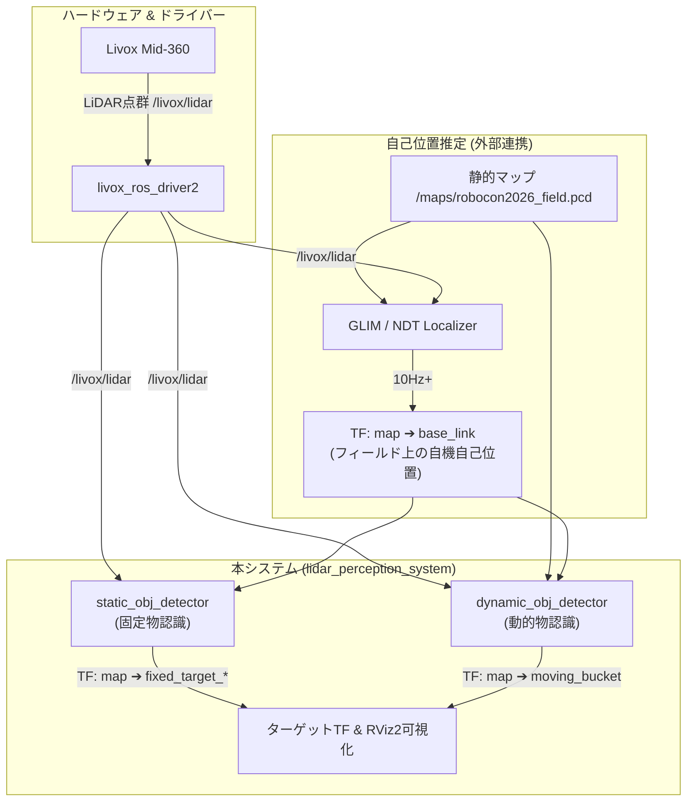

# LiDAR Perception System (LPS)

高専ロボコン2026向けの 3D LiDAR 空間認識 ROS 2 パッケージです。  
Livox Mid-360 から取得した 3D 点群データ（Point Cloud）を基に、自律移動および自動照準（エイム）に必要なターゲット空間座標をリアルタイム（10Hz以上）で算出・ブロードキャストします。

---

## 目次

1. [システム全体のアーキテクチャ・仕組み](#システム全体のアーキテクチャ仕組み)
2. [フィールド座標系の定義（1mm精度CAD準拠）](#フィールド座標系の定義1mm精度cad準拠)
3. [各ノードの内部処理メカニズム](#各ノードの内部処理メカニズム)
   * [1. 静的オブジェクト認識 (`static_obj_detector`)](#1-静的オブジェクト認識-static_obj_detector)
   * [2. 動的オブジェクト認識 (`dynamic_obj_detector`)](#2-動的オブジェクト認識-dynamic_obj_detector)
   * [3. オフライン開発用ダミーノード (`dummy_cloud_publisher`)](#3-オフライン開発用ダミーノード-dummy_cloud_publisher)
4. [ディレクトリ構成](#ディレクトリ構成)
5. [パラメータ設定 (`config/perception_params.yaml`)](#パラメータ設定-configperception_paramsyaml)
6. [ビルド・実行手順](#ビルド実行手順)

---

## システム全体のアーキテクチャ・仕組み

本システムは、LiDARドライバーおよび自己位置推定ノードと連携し、下図のデータフローに従ってリアルタイム（10Hz以上）に空間認識・ターゲットTF配信を行います。



### 座標変換 (TF Tree) の仕組み

処理を成立させるため、以下の TF ツリーが常時発行・維持されます：

```text
map (フィールド絶対座標系)
 └── base_link (ロボット中心) — [自己位置推定ノードが発行]
      └── livox_frame (LiDARセンサ位置) — [静的TF / ロボット設計値]
```

---

## フィールド座標系の定義（1mm精度CAD準拠）

公式CAD図面に基づき、フィールド座標系 (`map`) を次のように厳密に定義しています。

* **原点 (0, 0, 0)**: 中央教壇の長手方向中心線上の床面
* **X軸**: 左右方向。赤ゾーン（左側）がマイナス（`-5.70 m` 〜 `0.00 m`）、青ゾーン（右側）がプラス（`0.00 m` 〜 `+5.70 m`）。内寸幅 `11.40 m`。
* **Y軸**: 奥行き方向。**手前フェンスが `-4.70 m`、奥フェンス（コントロールST側）が `+5.80 m`（非対称）**。内寸奥行 `10.50 m`。
* **Z軸**: 垂直上向き方向。床面が `0.00 m`。

```text
      [奥フェンス / コントロールステーション] Y = +5.80m
┌───────────────────────────┬───────────────────────────┐
│                           │                           │
│     赤ゾーン (Red)        │     青ゾーン (Blue)       │
│     X: -5.70m ~ 0.00m     │     X: 0.00m ~ +5.70m     │
│                           │                           │
│                           │                           │
└───────────────────────────┴───────────────────────────┘ X = +5.70m
X = -5.70m  [手前フェンス] Y = -4.70m
```

---

## 各ノードの内部処理メカニズム

### 1. 静的オブジェクト認識 (`static_obj_detector`)

[static_obj_detector.cpp](file:///home/lambda/ros2_ws/src/LiDAR-Perception-System/src/static_obj_detector.cpp) は、固定配置されたターゲット（固定バケツ①〜③、旗）の絶対座標を高精度に特定します。

1. **TF座標変換**:
   生点群データ（`livox_frame`）を、TF2を用いてリアルタイムにフィールド絶対座標系（`map`）に変換します。
2. **VoxelGridダウンサンプリング**:
   処理負荷軽減のため、`pcl::VoxelGrid` フィルタ（デフォルト: `5 cm`）で点群を軽量化します。
3. **ROI (関心領域) クロップ**:
   [perception_params.yaml](file:///home/lambda/ros2_ws/src/LiDAR-Perception-System/config/perception_params.yaml) で設定された各ターゲットの理論座標を中心に、`pcl::CropBox` を用いて周囲の空間ボックス領域のみを切り出します。
4. **ユークリッド・クラスタリング**:
   ROI内に存在する点群に対して `pcl::EuclideanClusterExtraction` を適用し、最も点数の多いクラスタ（対象物本体）を抽出します。
5. **重心計算とTF配信**:
   抽出クラスタの重心（Centroid）を算出し、`fixed_target_fixed_bucket_1` や `fixed_target_flag` などの TF 座標および RViz2 用 3D マーカーを配信します。

---

### 2. 動的オブジェクト認識 (`dynamic_obj_detector`)

[dynamic_obj_detector.cpp](file:///home/lambda/ros2_ws/src/LiDAR-Perception-System/src/dynamic_obj_detector.cpp) は、移動する相手ロボットおよび移動バケツの位置を抽出し追従します。

1. **非反復スキャン対策（フレームリングバッファリング）**:
   Mid-360 LiDARは非反復スキャン特性を持つため、単一フレーム（`0.1 秒`）では高速移動する対象の点群が疎になります。これに対応するため、過去数フレーム（デフォルト: `3 フレーム`）の点群を各フレーム取得時点の TF を用いて `map` 座標系に変換した上で統合（リングバッファリング）し、輪郭を濃密化します。
2. **KD-Tree 高速背景差分**:
   事前生成されたCAD静的マップ PCD（`maps/robocon2026_field.pcd`）を KD-Tree (`pcl::KdTreeFLANN`) に展開。統合点群の各点に対し半径 `bg_subtraction_radius`（デフォルト: `10 cm`）以内の近傍探索を行い、静的マップに含まれる背景点（床・壁・台座など）を全自動で高速除去します。
3. **高さパススルーフィルタ**:
   背景除去後の「動的点群」に対し、移動バケツの規格高さ範囲（`Z = 1.2 m 〜 2.1 m`）のみを抽出します。
4. **透明ポリカバケツ透過対策フォールバック機能**:
   赤外線レーザーが透明ポリカバケツを透過・乱反射し、バケツ本体の点群が得られない場合、自動的に低い高さ範囲（`Z = 0.1 m 〜 1.0 m`）のロボット本体・台座クラスタを探索します。本体クラスタが検知された場合、その重心に高さオフセット（`fallback_virtual_z_offset`: `+0.80 m`）を加算した仮想ターゲット座標を自動生成します。
5. **ターゲットTF配信**:
   認識した移動バケツ（または仮想中心）の重心に `moving_bucket` TFをブロードキャストします。また、後から起動した RViz2 のために背景PCDマップ点群を1秒周期で連続再発行します。

---

### 3. オフライン開発用ダミーノード (`dummy_cloud_publisher`)

[dummy_cloud_publisher.cpp](file:///home/lambda/ros2_ws/src/LiDAR-Perception-System/src/dummy_cloud_publisher.cpp) は、実機や rosbag が存在しないPC環境でも単体動作確認を行うためのテスト用ノードです。
10Hz で仮想の LiDAR 点群（床面、固定バケツ、旗、円運動する移動相手ロボット）を発行し、同時に必要な TF (`map` ➔ `base_link` ➔ `livox_frame`) を自動配信します。

---

## ディレクトリ構成

```text
LiDAR-Perception-System/
├── CMakeLists.txt                  # ビルド設定ファイル
├── package.xml                     # ROS 2 パッケージマニフェスト
├── config/
│   └── perception_params.yaml      # 各種パラメータ設定ファイル (ROI, ボクセルサイズ等)
├── include/lidar_perception_system/
│   ├── static_obj_detector.hpp     # 静的オブジェクト認識ノード ヘッダー
│   └── dynamic_obj_detector.hpp    # 動的オブジェクト認識ノード ヘッダー
├── src/
│   ├── static_obj_detector.cpp     # ROIクロップ・固定物認識ノード
│   ├── dynamic_obj_detector.cpp    # 背景差分・動的物認識ノード (フォールバック付)
│   ├── generate_cad_map.cpp        # 1mm精度CAD準拠マップ自動生成ツール
│   └── dummy_cloud_publisher.cpp   # オフライン開発用ダミー点群/TF発行ノード
├── launch/
│   ├── perception.launch.py        # 本番環境用 Launch スクリプト
│   ├── test_dummy.launch.py        # ダミーテスト環境用 Launch スクリプト
│   └── rviz.launch.py              # 可視化用 RViz2 単体起動 Launch スクリプト
├── maps/
│   └── robocon2026_field.pcd       # CAD準拠 静的フィールド PCD マップ (約91万点)
└── rviz/
    └── perception_debug.rviz       # 事前セッティング済み RViz2 設定ファイル
```

---

## パラメータ設定 (`config/perception_params.yaml`)

[perception_params.yaml](file:///home/lambda/ros2_ws/src/LiDAR-Perception-System/config/perception_params.yaml) で主要な閾値や座標を変更できます。

| パラメータ名 | デフォルト値 | 説明 |
| --- | --- | --- |
| `voxel_leaf_size` | `0.05` | VoxelGrid ダウンサンプリングのボクセルサイズ (m) |
| `cluster_tolerance` | `0.15`〜`0.20` | クラスタリングの点間距離閾値 (m) |
| `min_cluster_size` | `15`〜`20` | クラスタと認める最小点数 |
| `bg_subtraction_radius` | `0.10` | 静的マップ点群との近傍検索除去判定半径 (m) |
| `frame_accumulation_count` | `3` | 動的検出時の非反復スキャン用フレーム統合数 |
| `moving_bucket_z_min / max` | `1.2` / `2.1` | 移動バケツの高さフィルタリング範囲 (m) |
| `enable_clear_bucket_fallback` | `true` | 透明バケツ透過対策フォールバック処理有効化フラグ |
| `fallback_virtual_z_offset` | `0.80` | 台座重心から仮想バケツ中心までの高さ加算オフセット (m) |

---

## ビルド・実行手順

### 1. ビルド
ROS 2 ワークスペースの `src` ディレクトリ配下に配置し、`colcon build` を実行します。

```bash
cd ~/ros2_ws
source /opt/ros/humble/setup.bash
colcon build --symlink-install --packages-select lidar_perception_system
source install/setup.bash
```

### 2. 実行

#### 1. 本番環境（実機 / rosbag 連携時）
認識ノード群（`static_obj_detector` / `dynamic_obj_detector`）のみを起動します。

本システムはターゲット認識・追従を担うため、**自己位置推定ノード（外部パッケージ）と連携**して動作します：
* **推奨自己位置推定パッケージ**: **GLIM (Localizationモード)** または **`ndt_localizer`**
* **自己位置推定の仕組み**: 外部ノードが LiDAR 点群と `maps/robocon2026_field.pcd` を点群マッチング照合し、`map` ➔ `base_link` の TF（自機現在地）を継続配信します。

起動時に `localization_type` 引数で切り替えが可能です：

```bash
# GLIM 連携で起動（デフォルト）
ros2 launch lidar_perception_system perception.launch.py

# NDT Localizer 連携で起動
ros2 launch lidar_perception_system perception.launch.py localization_type:=ndt
```

#### 2. オフライン動作テスト時（ダミー点群発行）
実機や rosbag がない環境で、ダミー点群・TFパブリッシャーを含めて起動します：

```bash
ros2 launch lidar_perception_system test_dummy.launch.py
```

#### 3. 可視化用 RViz2 の起動
設定済みの RViz2 を別ターミナルで起動します：

```bash
ros2 launch lidar_perception_system rviz.launch.py
```

---

## ライセンス

[Apache-2.0](LICENSE)